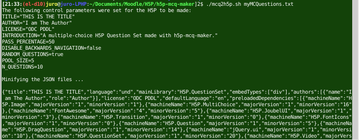
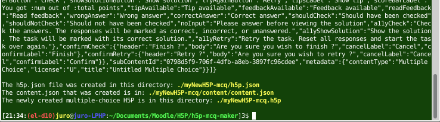

# h5p-mcq-maker  

This repository contains a bash script for creating an [H5P](https://h5p.org) of multiple-choice questions (with a single correct answer) using the [H5P Question Set template](https://h5p.org/question-set) via the linux command line. Simply:  
```sh
./mcq2h5p.sh myMCQuestions.txt
```
where `myMCQuestions.txt` (it may be named in some other way) is a plain text input file that contains your multiple-choice questions and corresponding answers written in [H5P Question Set template markup](https://h5p.org/question-set), e.g.,  
```
1. Which of the following is a letter?
10
9
*A

2. Which of the following is a number?
*35
a
q
z

3. 15 + 1 + 3 = _____
16
21
*19
11

```
(Note: Tips, correct- and wrong-answer feedback have not been implemented.  One cannot use them for now.)  
The H5P is created in the main directory and is called `myNewH5P-mcq.h5p`.  There are a number of ways to view/play this newly created H5P:  

* use [Lumi](https://app.lumi.education/), an offline H5P viewer and editor
* upload into a platform (e.g., [h5p.org's H5P test drive page](https://h5p.org/testdrive-h5p), Learning Management Systems (LMSs)); allows for further editing.
* view using [h5p-view](https://github.com/justineuro/h5p-view) (a bash script that implements [h5p-standalone](https://github.com/tunapanda/h5p-standalone) to allow viewing/playing the H5P via the linux command line).
* use [h5p-standalone](https://github.com/tunapanda/h5p-standalone) directly (as in [h5p-misc-math-001](https://justineuro.github.io/h5p-misc-math-001/) or [h5p-byBrowser](https://justineuro.github.io/h5p-byBrowser/)).

## Instructions on use
To use:

* Clone this repository: `git clone https://github.com/justineuro/h5p-mcq-maker.git`.
* Prepare a plain text file, say `myMCQuestions.txt` (it may be some other filename), containing your MC questions and answers written in [H5P Question Set template markup](https://h5p.org/question-set), and save it under the `h5p-mcq-maker` directory that you just cloned.
* Edit the `control.txt` file to set the parameters for your new H5P (includes  `TITLE`, `AUTHOR`, `LICENSE`, `INTRODUCTION`, `PASS_PERCENTAGE`, `DISABLE_BACKWARDS_NAVIGATION`, `RANDOM_QUESTIONS`, and `POOL_SIZE`; see `mcq2h5p.sh` for a description of these parameters).
* At a linux command line within your `h5p-mcq-maker` directory, issue the command:
```sh
./mcq2h5p.sh myMCQuestions.txt
```
where `myMCQuestions.txt` may be some other file containing your MC questions and answers.  **(Note: This file must end in two blank lines.)**  
The `h5p.json` and `content.json` files will be created in the appropriate locations inside the `myNewH5P-mcq` directory (this will be zipped-up to create your new H5P).  Your newly created [Question Set H5P](https://h5p.org/question-set), filename: `myNewH5P-mcq.h5p,` will be found in the `h5p-mcq-maker` directory.  
  
[... section omitted ...]  


## Contents of this repositoty
This folder includes (among others):
  
* [`mcq2h5p.sh`](./mcq2h5p.sh) - a bash script that converts a plain text file containing mutiple-choice questions and answers to a [Question Set H5P](https://h5p.org/question-set).
* [`myNewH5P-mcq`](./dist) - a folder that contains the libraries inside the [`question-set-616.h5p`](https://h5p.org/question-set) re-use template that's available from the [Examples & downloads section](https://h5p.org/content-types-and-applications) at [https://h5p.org](https://h5p.org); the `h5p.json` and `content/content.json` files will be over-written to produce your new H5P.  Among other libraries, this folder contains: __`H5P.QuestionSet-1.20`__, __`H5P.MultiChoice-1.16`__, and __`H5P.Question-1.5`__. 
* [`control.txt`](./control.txt) -  a plain text file containing the control parameters for your new H5P (e.g., `TITLE`, `AUTHOR`, `LICENSE`, `INTRODUCTION`, `PASS_PERCENTAGE`, `DISABLE_BACKWARDS_NAVIGATION`, `RANDOM_QUESTIONS`, and `POOL_SIZE`; these are used for creating the `h5p.json` and `content.json` of your new H5P).  You would want to edit this to suit your own specifications.
* [`myMCQuestions.txt`](./myMCQuestions.txt) - an example of 10 multiple-choice questions, five (5) of which are selected each time the H5P is viewed/played.  (Note that the `MathJax` symbol "`\`" has to be triply escaped.  Thus, `\(` should be written as `\\\\(` and `\sqrt{2}` should be written as `\\\\sqrt{2}`.)
* [`myNewH5P-mcq.h5p`](./myNewH5P-mcq.h5p) - the H5P created by `mcq2h5p.sh` from `myMCQuestions.txt`.


<a rel="license" href="http://creativecommons.org/licenses/by/4.0/"></a><br /><span xmlns:dct="http://purl.org/dc/terms/" property="dct:title">h5p-mcq-maker</span> by <a xmlns:cc="http://creativecommons.org/ns#" href="https://github.com/justineuro/" property="cc:attributionName" rel="cc:attributionURL">Justine Leon A. Uro</a> is licensed under a <a rel="license" href="http://creativecommons.org/licenses/by/4.0/">Creative Commons Attribution 4.0 International License</a>.<br />Based on a work at <a xmlns:dct="http://purl.org/dc/terms/" href="https://github.com/justineuro/h5p-mcq-maker" rel="dct:source">https://github.com/justineuro/h5p-mcq-maker</a>.
